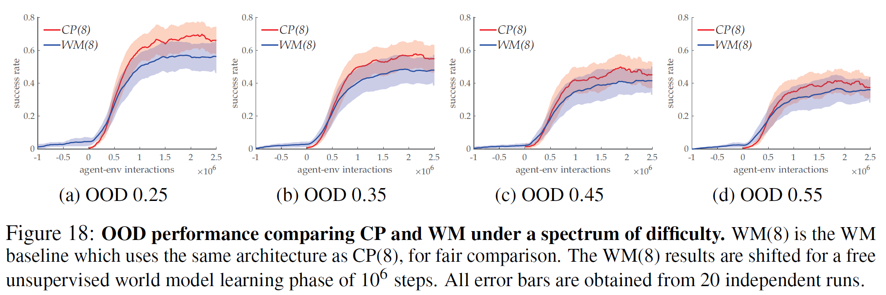
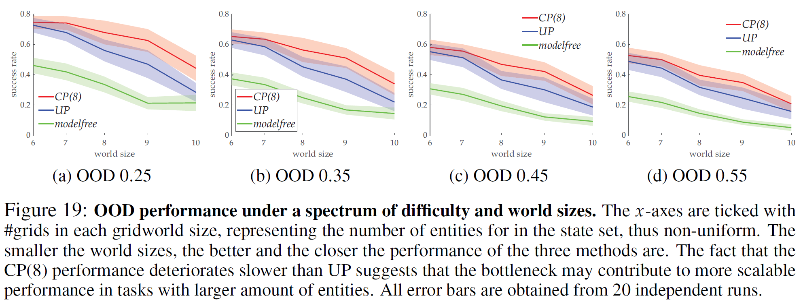
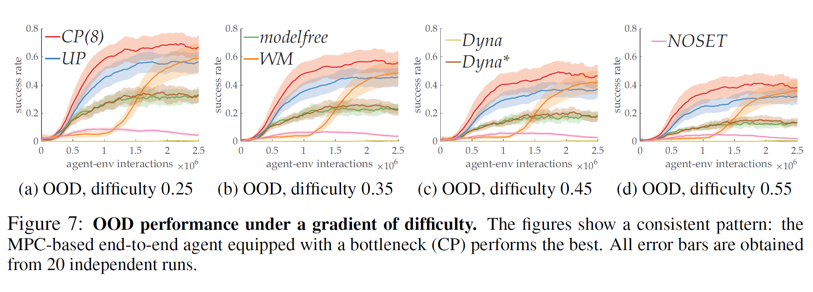
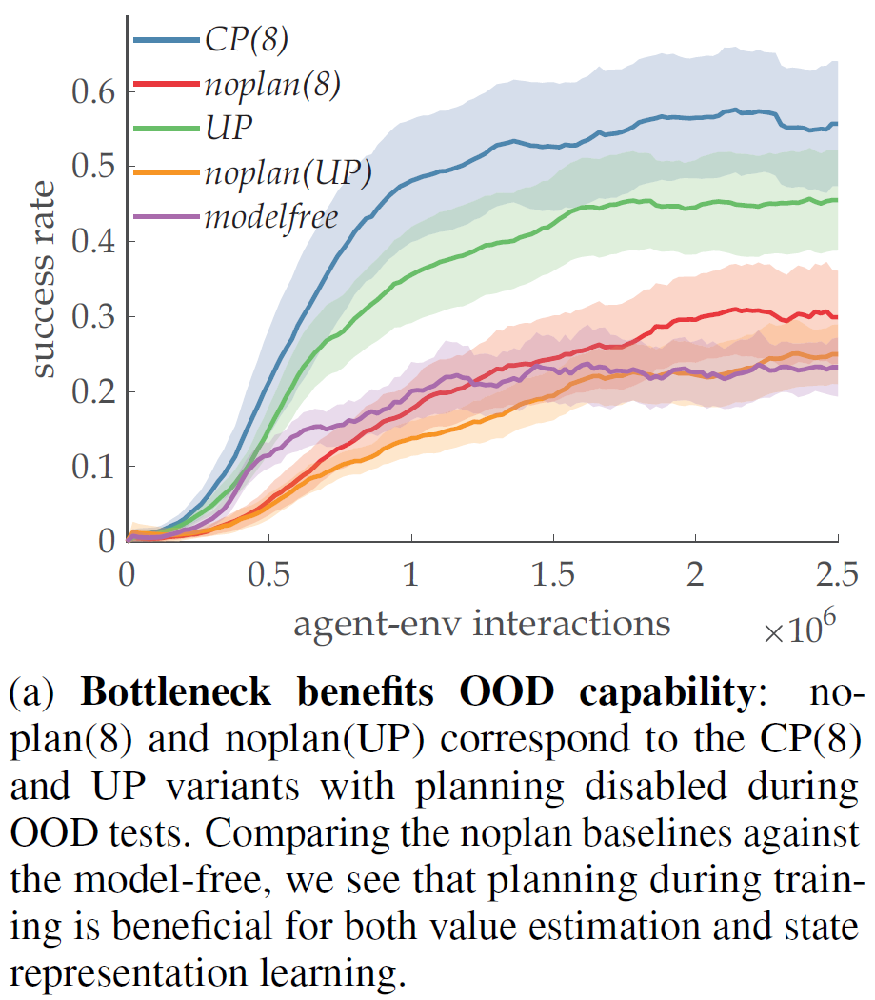
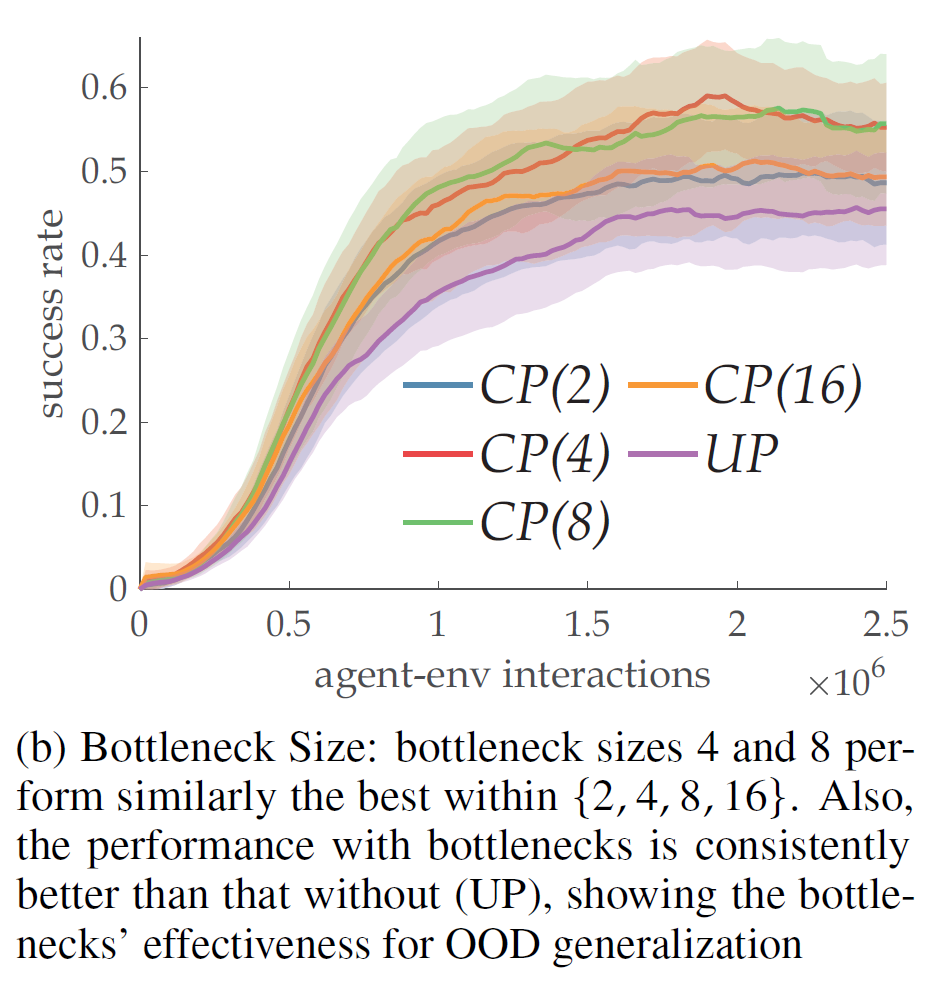
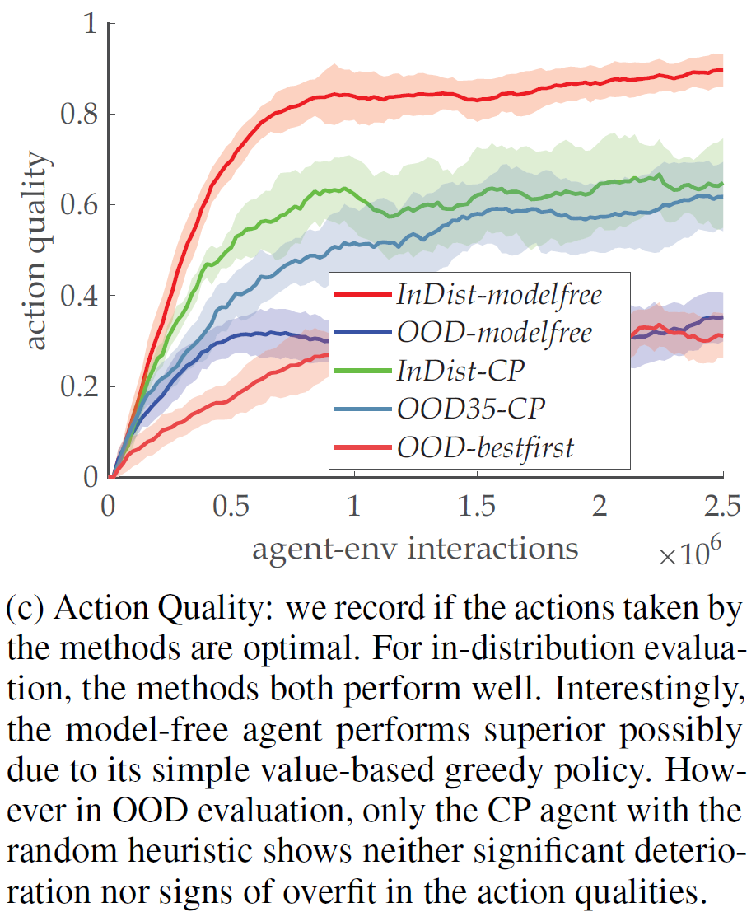

# Neurips2021-Rebuttal

Rebuttal materials for Neurips 2021 submissions. Purely anonymous.

All error bars are obtained from 20 independent seed runs.

## NEW Figure regarding Extended WM Baseline Performance

## NEW OOD Performance Figure with Different World Sizes

## UPDATED Figure 7

## UPDATED Figure 8(a)

## UPDATED Figure regarding Bottleneck Size Ablation

## UPDATED Figure regarding Action Quality Ablation

