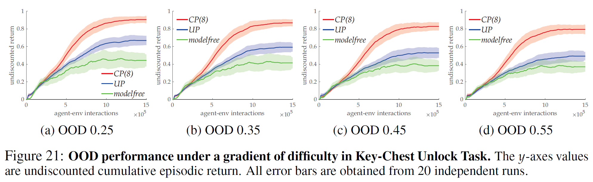
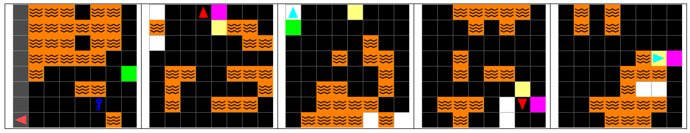

# Neurips2021-Materials for Replies to Reviewers

All error bars are obtained from 20 independent seed runs. All error bars in all figures in the manuscript have been updated with 20 independent seed runs.

## NEW Figure regarding OOD Performance on NEW Unlock Setting

## NEW Figure regarding Extended WM Baseline Performance

## NEW OOD Performance Figure with Different World Sizes

## UPDATED Figure 7

## UPDATED Figure 8(a)

## UPDATED Figure regarding Bottleneck Size Ablation

## UPDATED Figure regarding Action Quality Ablation

## BONUS Figure regarding Visualization of Unlock Tasks
After the key is obtained, its original location will be marked blue (the invert color is yellow).

